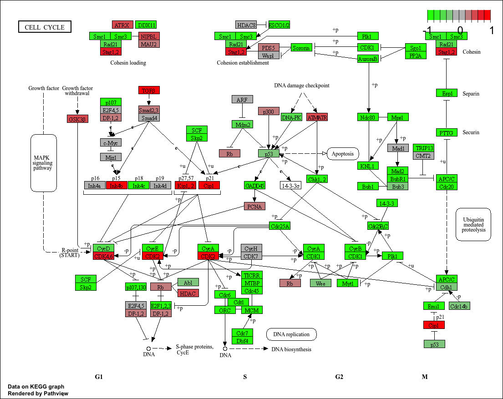
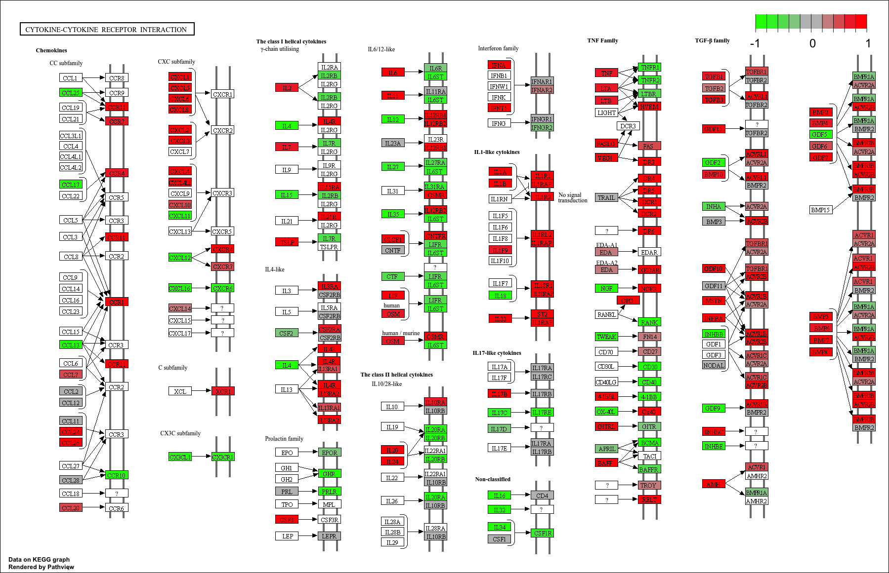
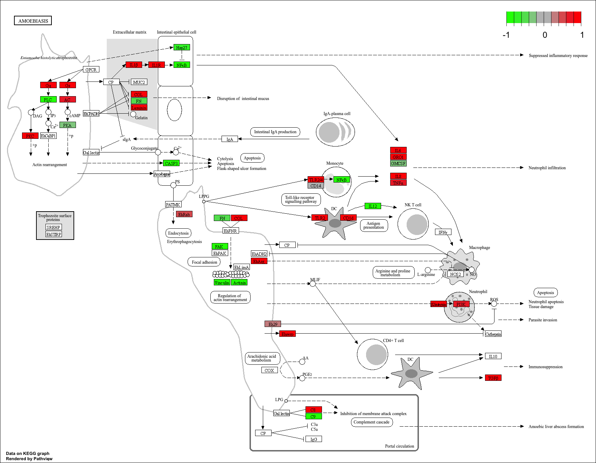
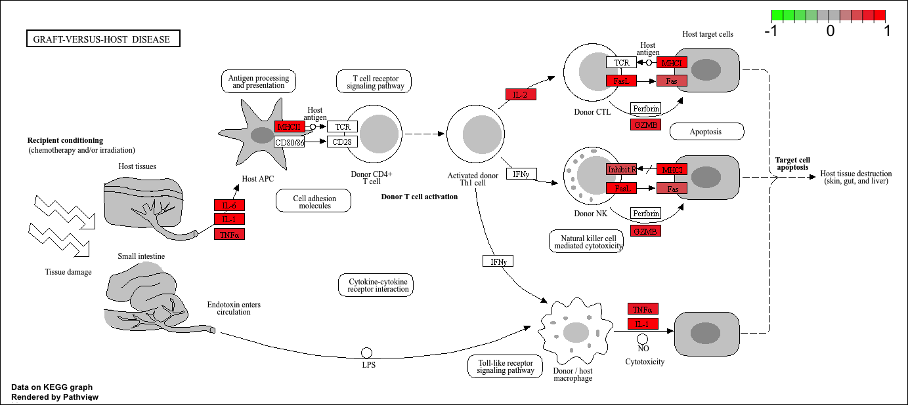

## Background

Our data today comes from the HOXA1 gene which is a developmental transcription factor required for lung fibroblast and HeLa cell cycle progression.


## Data Import

Loading DESeq2
```{r, message = F}
library(DESeq2)
```

Data import
```{r}
metaFile <- "GSE37704_metadata.csv"
countFile <- "GSE37704_featurecounts.csv"

# Import metadata and take a peek
colData = read.csv(metaFile, row.names=1)
head(colData)
```

```{r}
# Import countdata
countData = read.csv(countFile, row.names=1)
head(countData)
```

> Q. Complete the code below to remove the troublesome first column from countData

We need to remove the first "length" column from `countData` to have a 1:1 correspondence with `colData` rows.

```{r}
countData <- countData[,-1]
```

```{r}
rownames(colData) == colnames(countData)
```

> Q. Complete the code below to filter countData to exclude genes (i.e. rows) where we have 0 read count across all samples (i.e. columns).

## Remove zero count genes
Some genes (rows) have no count data (i.e. zero values). We should remove these before any further analysis.

```{r}
to.keep <- rowSums(countData) > 0
countData <- countData[to.keep,]
```

# DESeq analysis

## Setup for DESeq

```{r}
dds <- DESeqDataSetFromMatrix(countData = countData, 
                              colData = colData, 
                              design = ~condition)
```

### Run DeSeq

```{r}
dds <- DESeq(dds)
```

### Get results

```{r}
res <- results(dds)
```
> Call the summary() function on your results to get a sense of how many genes are up or down-regulated at the default 0.1 p-value cutoff.

```{r}
summary(res)
```


## Results

```{r}
head(res)
```

## Volcano plot

```{r}
library(ggplot2)

ggplot(res)+
  aes(log2FoldChange,
      -log(padj))+
  geom_point()

```

> Q. Improve this plot by completing the below code, which adds color, axis labels and cutoff lines:

Let's add some color to this plot along with cutoff lines for fold-change and P-value

```{r}
mycols <- rep("gray", nrow(res))
mycols[abs(res$log2FoldChange) > 2] <- "darkgreen"
mycols[res$padj > 0.01] <- "gray"
```

```{r}
ggplot(res)+
  aes(log2FoldChange,
      -log(padj))+
  geom_point(col = mycols)+
  geom_vline(xintercept = c(-2,2))+
  geom_hline(yintercept = -log(0.01))
```

## Adding Gene Annotation

>Q. Use the mapIDs() function multiple times to add SYMBOL, ENTREZID and GENENAME annotation to our results by completing the code below.

```{r}
library("AnnotationDbi")
library("org.Hs.eg.db")

columns(org.Hs.eg.db)

res$symbol = mapIds(org.Hs.eg.db,
                    keys= row.names(res), 
                    keytype="ENSEMBL",
                    column="SYMBOL",
                    multiVals="first")

res$entrez = mapIds(org.Hs.eg.db,
                    keys=row.names(res),
                    keytype="ENSEMBL",
                    column="ENTREZID",
                    multiVals="first")

res$name =   mapIds(org.Hs.eg.db,
                    keys=row.names(res),
                    keytype="ENSEMBL",
                    column="GENENAME",
                    multiVals="first")

head(res, 10)
```

### Save annotated results

> Q. Finally for this section let's reorder these results by adjusted p-value and save them to a CSV file in your current project directory.

```{r}
write.csv(res, file = "results_annotated.csv")
```

## Pathway Analysis

```{r, message = F}
library(gage)
library(gageData)
library(pathview)
```

```{r}
data(kegg.sets.hs)
```

```{r}
foldchanges <- res$log2FoldChange
names(foldchanges) <- res$entrez
```

```{r}
keggres <-gage(foldchanges, gsets=kegg.sets.hs)
```

```{r}
# Look at the first few down (less) pathways
head(keggres$less)
```

```{r}
pathview(gene.data=foldchanges, pathway.id="hsa04110")
```


> Q. Can you do the same procedure as above to plot the pathview figures for the top 5 down-regulated pathways?

```{r}
## Focus on top 5 upregulated pathways here for demo purposes only
keggrespathways <- rownames(keggres$greater)[1:5]

# Extract the 8 character long IDs part of each string
keggresids = substr(keggrespathways, start=1, stop=8)
keggresids
```

```{r}
pathview(gene.data=foldchanges, pathway.id="hsa04060")
```

```{r}
pathview(gene.data=foldchanges, pathway.id="hsa05323")
```


```{r}
pathview(gene.data=foldchanges, pathway.id="hsa05146")
```


```{r}
pathview(gene.data=foldchanges, pathway.id="hsa05332")
```



```{r}
pathview(gene.data=foldchanges, pathway.id="hsa04640")
```


### GO analysis

Focus on the Biological Process "BP" section of GO

```{r}
data(go.sets.hs)
data(go.subs.hs)

# Focus on Biological Process subset of GO
gobpsets = go.sets.hs[go.subs.hs$BP]

```

```{r}
gobpres <- gage(foldchanges, gsets=gobpsets)
lapply(gobpres, head)
```

## Reactome Analysis

We can use the new(ish) Reactome pathway viewer online at https://reactome.org/

```{r}
sig_genes <- res[res$padj <= 0.05 & !is.na(res$padj), "symbol"]
print(paste("Total number of significant genes:", length(sig_genes)))
```

The website wants a list of genes to work with. We can write one out with the `write.table()` function

```{r}
write.table(sig_genes, file="significant_genes.txt", row.names=FALSE, col.names=FALSE, quote=FALSE)
```

And a figure from Reactome


> Q: What pathway has the most significant “Entities p-value”? Do the most significant pathways listed match your previous KEGG results? What factors could cause differences between the two methods?

In the cell cycle, the Mitotic pathway has the most significant "Entities p-value" of 2.1E-5. Compared to the previous KEGG results, the most significant does not match because KEGG only shows cell-cycle as the lowest p-value which is not that specific. Differences in specificity causes differences between the two methods.


