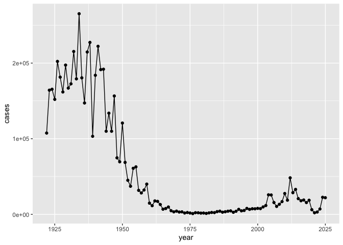
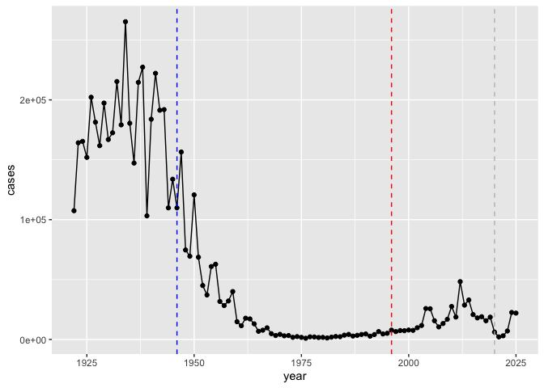
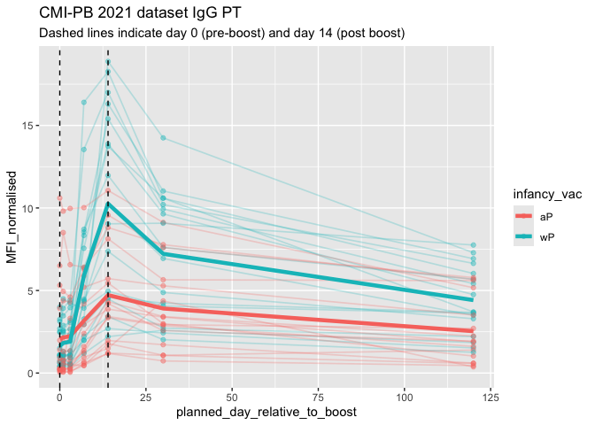

# Class 18: Pertussis Mini-Project
Alfred Phyo (PID: A18129346)

- [Background](#background)
- [CDC tracking data](#cdc-tracking-data)
  - [Exploring CMI-PB data](#exploring-cmi-pb-data)
  - [Examine IgG Ab titer levels](#examine-igg-ab-titer-levels)

# Background

Pertussis (whooping cough) is a common lung infection caused by the
bacteria B. Pertussis. It can infect anyone but is most deadly for
infants (under 1 year of age)

# CDC tracking data

The CDC tracks the number of Pertussis cases:

> Q1. I want a plot of year vs cases

``` r
library(ggplot2)

ggplot(cdc) +
  aes(year, cases) +
  geom_point() +
  geom_line()
```



> Q2. Add annotation lines for the major milestones of wP vaccination
> roll-out (1946) and the switch to the aP vaccine (1996). What do you
> notice?

There is a big decrease in Pertussis cases from 1946 to 1996 after
switching to the aP vaccine.

``` r
ggplot(cdc) +
  aes(year, cases) +
  geom_point() +
  geom_line() +
  geom_vline(xintercept = 1946, col="blue", lty =2)+
  geom_vline(xintercept = 1996, col = "red", lty =2) + 
  geom_vline(xintercept = 2020, col = "gray", lty = 2)
```



> Q3. Describe what happened after the introduction of the aP vaccine?
> Do you have a possible explanation for the observed trend?

There is an upward trend in Pertussis cases after the introduction of
the aP vaccine in 1996. Some possible explanations are that less people
are getting vaccinated, the bacteria could be evolving, and our methods
on testing for these data are becoming more accurate than before.

> Additional points for discussion: How are vaccines currently approved?

Vaccines are currently approved by the FDA through rigorous clinical
trials and evaluation of safety, efficacy, and manufacturing quality. It
is more strict than how it was in the past.

## Exploring CMI-PB data

The CMI-PB project <https://www.cmi-pb.org/> The mission of CMI-PB is to
provide the scientific community with a comprehensive, high-quality and
freely accessible resource of Pertussis booster vaccination.

Basically, make available a large dataset on the immune response to
Pertussis. They use a “booster” vaccination as a proxy for Pertussis
infection.

They make their data availale as JSON format API. We can read this into
R with the `read_json()` function from the **jsonlite** package:

``` r
library(jsonlite)

subject <- read_json("https://www.cmi-pb.org/api/v5_1/subject", simplifyVector = TRUE)
head(subject)
```

      subject_id infancy_vac biological_sex              ethnicity  race
    1          1          wP         Female Not Hispanic or Latino White
    2          2          wP         Female Not Hispanic or Latino White
    3          3          wP         Female                Unknown White
    4          4          wP           Male Not Hispanic or Latino Asian
    5          5          wP           Male Not Hispanic or Latino Asian
    6          6          wP         Female Not Hispanic or Latino White
      year_of_birth date_of_boost      dataset
    1    1986-01-01    2016-09-12 2020_dataset
    2    1968-01-01    2019-01-28 2020_dataset
    3    1983-01-01    2016-10-10 2020_dataset
    4    1988-01-01    2016-08-29 2020_dataset
    5    1991-01-01    2016-08-29 2020_dataset
    6    1988-01-01    2016-10-10 2020_dataset

> Q4. How many aP and wP individuals are there in this `subject` table?

``` r
table(subject$infancy_vac)
```


    aP wP 
    87 85 

> Q5. How many male/female are there?

``` r
table(subject$biological_sex)
```


    Female   Male 
       112     60 

> Q6. What is the breakdown of race and biological sex (e.g. number of
> Asian females, White males etc…)?

``` r
table(subject$race, subject$biological_sex)
```

                                               
                                                Female Male
      American Indian/Alaska Native                  0    1
      Asian                                         32   12
      Black or African American                      2    3
      More Than One Race                            15    4
      Native Hawaiian or Other Pacific Islander      1    1
      Unknown or Not Reported                       14    7
      White                                         48   32

> Q. Is this representative of the US population?

No, it’s not representative of the US population.

We can read more tables from the CMI-PB database

``` r
specimen <- read_json("https://www.cmi-pb.org/api/v5_1/specimen", simplifyVector = T)
ab_titer <- read_json("https://www.cmi-pb.org/api/v5_1/plasma_ab_titer", simplifyVector = T)
```

``` r
head(specimen)
```

      specimen_id subject_id actual_day_relative_to_boost
    1           1          1                           -3
    2           2          1                            1
    3           3          1                            3
    4           4          1                            7
    5           5          1                           11
    6           6          1                           32
      planned_day_relative_to_boost specimen_type visit
    1                             0         Blood     1
    2                             1         Blood     2
    3                             3         Blood     3
    4                             7         Blood     4
    5                            14         Blood     5
    6                            30         Blood     6

``` r
head(ab_titer)
```

      specimen_id isotype is_antigen_specific antigen        MFI MFI_normalised
    1           1     IgE               FALSE   Total 1110.21154       2.493425
    2           1     IgE               FALSE   Total 2708.91616       2.493425
    3           1     IgG                TRUE      PT   68.56614       3.736992
    4           1     IgG                TRUE     PRN  332.12718       2.602350
    5           1     IgG                TRUE     FHA 1887.12263      34.050956
    6           1     IgE                TRUE     ACT    0.10000       1.000000
       unit lower_limit_of_detection
    1 UG/ML                 2.096133
    2 IU/ML                29.170000
    3 IU/ML                 0.530000
    4 IU/ML                 6.205949
    5 IU/ML                 4.679535
    6 IU/ML                 2.816431

> Q9. Complete the code to join specimen and subject tables to make a
> new merged data frame containing all specimen records along with their
> associated subject details:

To make sense of all this data we need to “join” (a.k.a. “merge” or
“link”) all these tables together. Only then will you know that a given
Ab measurement (from the `ab_titer` table) was collected on a certain
date (from the `specimen` table) from a certain wP or aP subject (from
the `subject` table).

We can use **dplyr** and the `*join()` family of functions to do this.

``` r
library(dplyr)
```


    Attaching package: 'dplyr'

    The following objects are masked from 'package:stats':

        filter, lag

    The following objects are masked from 'package:base':

        intersect, setdiff, setequal, union

``` r
meta <- inner_join(subject, specimen)
```

    Joining with `by = join_by(subject_id)`

``` r
head(meta) 
```

      subject_id infancy_vac biological_sex              ethnicity  race
    1          1          wP         Female Not Hispanic or Latino White
    2          1          wP         Female Not Hispanic or Latino White
    3          1          wP         Female Not Hispanic or Latino White
    4          1          wP         Female Not Hispanic or Latino White
    5          1          wP         Female Not Hispanic or Latino White
    6          1          wP         Female Not Hispanic or Latino White
      year_of_birth date_of_boost      dataset specimen_id
    1    1986-01-01    2016-09-12 2020_dataset           1
    2    1986-01-01    2016-09-12 2020_dataset           2
    3    1986-01-01    2016-09-12 2020_dataset           3
    4    1986-01-01    2016-09-12 2020_dataset           4
    5    1986-01-01    2016-09-12 2020_dataset           5
    6    1986-01-01    2016-09-12 2020_dataset           6
      actual_day_relative_to_boost planned_day_relative_to_boost specimen_type
    1                           -3                             0         Blood
    2                            1                             1         Blood
    3                            3                             3         Blood
    4                            7                             7         Blood
    5                           11                            14         Blood
    6                           32                            30         Blood
      visit
    1     1
    2     2
    3     3
    4     4
    5     5
    6     6

> Q10. Now using the same procedure join meta with titer data so we can
> further analyze this data in terms of time of visit aP/wP, male/female
> etc.

Let’s do one more `inner_join()` to join the `ab_titer` with all our
`meta` data.

``` r
abdata <- inner_join(ab_titer, meta)
```

    Joining with `by = join_by(specimen_id)`

``` r
head(abdata) 
```

      specimen_id isotype is_antigen_specific antigen        MFI MFI_normalised
    1           1     IgE               FALSE   Total 1110.21154       2.493425
    2           1     IgE               FALSE   Total 2708.91616       2.493425
    3           1     IgG                TRUE      PT   68.56614       3.736992
    4           1     IgG                TRUE     PRN  332.12718       2.602350
    5           1     IgG                TRUE     FHA 1887.12263      34.050956
    6           1     IgE                TRUE     ACT    0.10000       1.000000
       unit lower_limit_of_detection subject_id infancy_vac biological_sex
    1 UG/ML                 2.096133          1          wP         Female
    2 IU/ML                29.170000          1          wP         Female
    3 IU/ML                 0.530000          1          wP         Female
    4 IU/ML                 6.205949          1          wP         Female
    5 IU/ML                 4.679535          1          wP         Female
    6 IU/ML                 2.816431          1          wP         Female
                   ethnicity  race year_of_birth date_of_boost      dataset
    1 Not Hispanic or Latino White    1986-01-01    2016-09-12 2020_dataset
    2 Not Hispanic or Latino White    1986-01-01    2016-09-12 2020_dataset
    3 Not Hispanic or Latino White    1986-01-01    2016-09-12 2020_dataset
    4 Not Hispanic or Latino White    1986-01-01    2016-09-12 2020_dataset
    5 Not Hispanic or Latino White    1986-01-01    2016-09-12 2020_dataset
    6 Not Hispanic or Latino White    1986-01-01    2016-09-12 2020_dataset
      actual_day_relative_to_boost planned_day_relative_to_boost specimen_type
    1                           -3                             0         Blood
    2                           -3                             0         Blood
    3                           -3                             0         Blood
    4                           -3                             0         Blood
    5                           -3                             0         Blood
    6                           -3                             0         Blood
      visit
    1     1
    2     1
    3     1
    4     1
    5     1
    6     1

> Q11. How many specimens (i.e. entries in abdata) do we have for each
> isotype?

``` r
table(abdata$isotype)
```


      IgE   IgG  IgG1  IgG2  IgG3  IgG4 
     6698  7265 11993 12000 12000 12000 

> Q. How many different “antigen” values are measured?

16 different antigen values are measured.

``` r
table(abdata$antigen)
```


        ACT   BETV1      DT   FELD1     FHA  FIM2/3   LOLP1     LOS Measles     OVA 
       1970    1970    6318    1970    6712    6318    1970    1970    1970    6318 
        PD1     PRN      PT     PTM   Total      TT 
       1970    6712    6712    1970     788    6318 

> Q12. What are the different \$dataset values in abdata and what do you
> notice about the number of rows for the most “recent” dataset?

The most “recent” dataset does not follow the downward trend. It seems
to have a jump (doubled) in data compared to the previous year.

``` r
table(abdata$dataset)
```


    2020_dataset 2021_dataset 2022_dataset 2023_dataset 
           31520         8085         7301        15050 

## Examine IgG Ab titer levels

Let’s focus on IgG isotype

``` r
igg <- abdata |>
        filter(isotype=="IgG")

head(igg)
```

      specimen_id isotype is_antigen_specific antigen        MFI MFI_normalised
    1           1     IgG                TRUE      PT   68.56614       3.736992
    2           1     IgG                TRUE     PRN  332.12718       2.602350
    3           1     IgG                TRUE     FHA 1887.12263      34.050956
    4          19     IgG                TRUE      PT   20.11607       1.096366
    5          19     IgG                TRUE     PRN  976.67419       7.652635
    6          19     IgG                TRUE     FHA   60.76626       1.096457
       unit lower_limit_of_detection subject_id infancy_vac biological_sex
    1 IU/ML                 0.530000          1          wP         Female
    2 IU/ML                 6.205949          1          wP         Female
    3 IU/ML                 4.679535          1          wP         Female
    4 IU/ML                 0.530000          3          wP         Female
    5 IU/ML                 6.205949          3          wP         Female
    6 IU/ML                 4.679535          3          wP         Female
                   ethnicity  race year_of_birth date_of_boost      dataset
    1 Not Hispanic or Latino White    1986-01-01    2016-09-12 2020_dataset
    2 Not Hispanic or Latino White    1986-01-01    2016-09-12 2020_dataset
    3 Not Hispanic or Latino White    1986-01-01    2016-09-12 2020_dataset
    4                Unknown White    1983-01-01    2016-10-10 2020_dataset
    5                Unknown White    1983-01-01    2016-10-10 2020_dataset
    6                Unknown White    1983-01-01    2016-10-10 2020_dataset
      actual_day_relative_to_boost planned_day_relative_to_boost specimen_type
    1                           -3                             0         Blood
    2                           -3                             0         Blood
    3                           -3                             0         Blood
    4                           -3                             0         Blood
    5                           -3                             0         Blood
    6                           -3                             0         Blood
      visit
    1     1
    2     1
    3     1
    4     1
    5     1
    6     1

> Q13. Complete the following code to make a summary boxplot of Ab titer
> levels (MFI) for all antigens:

Make a plot of `MFI_normalised` values for all `antigen` values.

``` r
library(ggplot2)

ggplot(igg) +
  aes(MFI_normalised, antigen) +
  geom_boxplot()+
  xlim(0,75) +
  facet_wrap(vars(visit), nrow=2)
```

    Warning: Removed 5 rows containing non-finite outside the scale range
    (`stat_boxplot()`).


> Q14. What antigens show differences in the level of IgG antibody
> titers recognizing them over time? Why these and not others?

The antigens “PT”, “FIM2/3” and “FHA” appear to have the widest range of
values. These antigens show differences in the level of IgG antibody
titers recognizing them because they play a key role in the immune
response (both for protection and diagnosis) for Bordetella pertussis.

> Q. Is there a difference for these responses between aP and wP
> individuals?

Yes.

``` r
ggplot(igg) +
  aes(MFI_normalised, antigen, col = infancy_vac) +
  geom_boxplot()
```


``` r
ggplot(igg) +
  aes(MFI_normalised, antigen) +
  geom_boxplot() + 
  facet_wrap(~infancy_vac)
```


> Q. Is there a difference with time (i.e. before booster shot vs. after
> booster shot)?

``` r
ggplot(igg) +
  aes(MFI_normalised, antigen, col = infancy_vac) +
  geom_boxplot() +
  facet_wrap(~visit)
```


``` r
## filter to 2021 dataset, IgG and PT
abdata.21 <- abdata %>% filter(dataset == "2021_dataset")

abdata.21 %>% 
  filter(isotype == "IgG",  antigen == "PT") %>%
  ggplot() +
    aes(x=planned_day_relative_to_boost,
        y=MFI_normalised,
        col=infancy_vac,
        group=subject_id) +
  
# Individual subject trajectories (thin, faint)
    geom_point(alpha = 0.4, size = 1.5) +
    geom_line(alpha = 0.25, linewidth = 0.6) +
  
# Smooth bold average trendlines for aP and wP
  stat_summary(fun = mean,
               geom = "smooth",
               se = FALSE,
               linewidth = 1.6,
               span = 0.5,
               aes(group = infancy_vac, col = infancy_vac)) +
  
  # Reference lines
    geom_vline(xintercept=0, linetype="dashed") +
    geom_vline(xintercept=14, linetype="dashed") +
  labs(title="CMI-PB 2021 dataset IgG PT",
       subtitle = "Dashed lines indicate day 0 (pre-boost) and day 14 (post boost)")
```

    Warning in stat_summary(fun = mean, geom = "smooth", se = FALSE, linewidth =
    1.6, : Ignoring unknown parameters: `span`



> Q18. Does this trend look similar for the 2020 dataset?

No, it looks completely different since the 2021 dataset had a
significant decrease from the 2020 dataset.

``` r
## filter to 2020 dataset, IgG and PT only
abdata.20 <- abdata %>% filter(dataset == "2020_dataset")

abdata.20 %>% 
  filter(isotype == "IgG",  antigen == "PT") %>%
  ggplot() +
    aes(x=planned_day_relative_to_boost,
        y=MFI_normalised,
        col=infancy_vac,
        group=subject_id) +
    geom_point() +
    geom_line() +
    geom_vline(xintercept=0, linetype="dashed") +
    geom_vline(xintercept=14, linetype="dashed") +
  labs(title="2020 dataset IgG PT",
       subtitle = "Dashed lines indicate day 0 (pre-boost) and 14 (apparent peak levels)")
```


